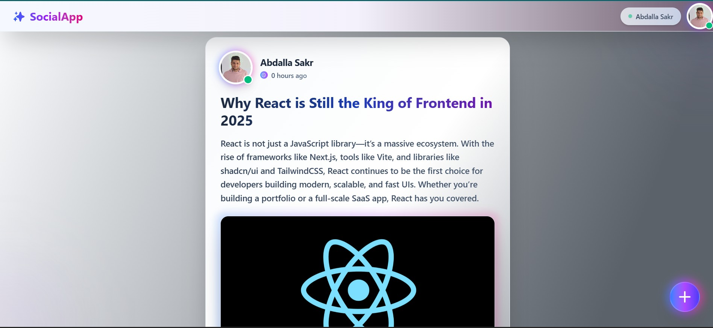

# SociallApp 🌐📸

**SociallApp** is a simple social media platform built using **React**, **Tailwind CSS**, and **DaisyUI**.  
It allows users to register, login, and create, edit, or delete their own posts — each with a title, description, image, and creation time.
The app is now fully connected to a **Node.js + Express + MongoDB** backend.

> 🔗 **Live Demo:** [https://social-app-gamma-nine.vercel.app](https://social-app-gamma-nine.vercel.app)  
> 📁 **Frontend Repository:** [https://github.com/abdallaskar/SocialApp](https://github.com/abdallaskar/SocialApp)  
> 📁 **Backend Repository:** [https://github.com/abdallaskar/SocialApp_Backend](https://github.com/abdallaskar/SocialApp_Backend)  
> 🔗 **You Tube Vide:** [https://youtu.be/MMw4khoZebc](https://youtu.be/MMw4khoZebc)

---

## 🚀 Features

- 🔐 User Authentication (Register, Login, Logout)
- 🏠 Home Feed (All public posts)
- 📝 Create Post (Title, description, image)
- ✏️ Edit/Delete Posts (Only by post owner)
- 👤 User avatar, name, and timestamps
- ⚙️ Backend with Express & MongoDB for real data persistence
- 🚫 Restricted actions when logged out

---

## 📸 Screenshots




---

## 🛠️ Tech Stack

### Frontend
- [React](https://reactjs.org/)
- [React Router](https://reactrouter.com/)
- [Tailwind CSS](https://tailwindcss.com/)
- [DaisyUI](https://daisyui.com/)
- [Uploadcare](https://uploadcare.com/) – For image uploads

### Backend
- [Node.js](https://nodejs.org/)
- [Express](https://expressjs.com/)
- [MongoDB Atlas](https://www.mongodb.com/cloud/atlas)
- [JWT](https://jwt.io/) – Authentication
- [Railway](https://railway.app/) – Deployment

---

## 🧪 System Overview

### 🔐 Authentication
- Full name, email, password, and profile image required
- Authentication managed with JWT and React Context
- Protected routes and conditional UI rendering

### 📝 Posts
- Each post includes: title, description, image, timestamp, and owner info
- Only authenticated users can create/edit/delete their own posts
- Non-authenticated users can browse but not interact

---

## 💻 Getting Started – Frontend

### 1. Clone the Repository

```bash
git clone https://github.com/abdallaskar/SocialApp.git
cd SocialApp
